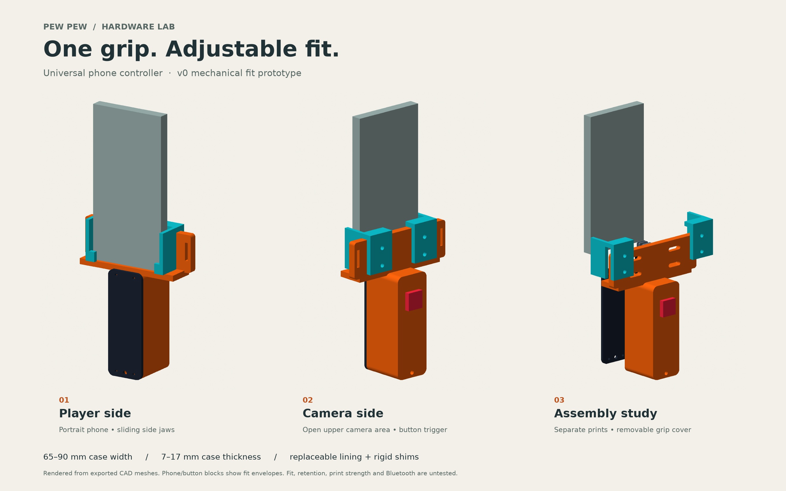

# PEW PEW — Universal phone controller / v0

**Status: printable CAD fit prototype, not a validated game accessory.**

An adjustable portrait phone mount on a bright arcade grip, with an index-finger momentary trigger button and space to explore a Bluetooth input board. The phone supplies the camera aim, virtual laser, audio and haptics. There is no physical laser or projectile mechanism.

This packet answers the request to start making tangible 3D-print assets. It remains design exploration under technical-spec §23.4; it does not freeze an app slice or change game contracts. Owner: Design. Exclusive write set: `design/hardware/universal-controller/**`. Integration/iOS handoff is in [integration-proposal.md](integration-proposal.md).

## Universal within a stated range

| Dimension | Prototype target |
|---|---|
| Phone width, including case | 65–90 mm; two sliding jaws lock using screws |
| Phone thickness, including case | 7–17 mm; rigid rear shims plus soft protective lining take up the gap |
| Phone orientation | Portrait; measure the phone in its normal case |
| Camera clearance | Cradle occupies only the lower approximately 40 mm of the phone; check every lens and its wide-angle view on the actual phone |
| Phone height | No top stop in the CAD; height, balance and retention still require a per-phone test |
| Excluded until tested/redesigned | Folded/folding phones, tablets, unusually thick cases, rear rings/wallets and cases with unusual lower protrusions |

“Universal” means adjustable dimensions, not a promise that every phone fits. Side buttons, ports, screen gestures, lens view and case geometry can still conflict. The 65–90 mm range is a geometric design target. Soft pad compression, print tolerance and practical retention have not been measured. A real phone/case fit matrix is still empty.

## Files

- [Printable STL parts](exports/) — separate meshes, millimetres. Import at 100% scale; STL itself does not encode units.
- [CAD source](cad/) — editable Python parameters and constructive geometry. Blender is not required to regenerate the parts.
- [Assembly manifest](exports/assembly-manifest.json) — placement, material colours, dimensions and prototype assumptions.
- [Input proposal](integration-proposal.md) — the proposed button-to-game connection and owner handoff.
- [Preview renderer](previews/render_preview.py) — renders the actual exported meshes, not a styled concept illustration.

To regenerate, create an isolated Python 3.12+ environment (tested on 3.14.5), install `cad/requirements.txt`, then run `python cad/generate.py` from this directory. Optional nominal assembly dimensions: `python cad/generate.py --phone-width 77 --phone-thickness 11 --phone-height 155`. Width accepts 65–90 mm; thickness accepts integer 7–17 mm values. Height changes the reference phone envelope only. The same printed jaws slide across the target width range; regeneration is useful for checking the chosen assembly and shim stack. Fixed structural dimensions require CAD review before changes. To regenerate the review image, also install the version in `previews/requirements.txt` and run `python previews/render_preview.py`.

Print orientations, exact part sizes and validation results are recorded alongside the exports. Rendered phone/button envelopes are references and must not be printed as functional parts.

## Trigger and electronics

For v0, a purchased **16 mm normally-open momentary pushbutton** is the trigger. Its internal mechanism provides travel and spring return. The shell provides the mounting bore; this kit does not yet contain a pivoting trigger paddle. The replaceable button lets us validate finger reach and button force before designing a more elaborate trigger.

The reference is [Adafruit product 1505](https://www.adafruit.com/product/1505), whose published overall envelope is about 18 × 18 × 29.4 mm. The CAD uses a 16.4 mm trial bore. Confirm the actual switch, nut, panel thickness and wiring bends before printing the complete grip. This source supports dimensions and switch type; it does not prove fit or comfort in this design.

A small BLE board can later report physical press/release into the app. [Seeed's XIAO nRF52840 documentation](https://wiki.seeedstudio.com/XIAO_BLE/) describes a 21 × 17.8 mm BLE board suitable for a bench experiment. No board-specific mounting, wiring, firmware, battery or Bluetooth-to-game support is shipped in this packet. The first electronic test should use an external USB power source with the grip cover removed as needed.

## Prototype hardware

| Item | Quantity | Purpose |
|---|---:|---|
| M4 × 20 mm low-profile button-head bolts | 4 | Lock the two sliding jaws; head ≤8.4 mm diameter and ≤2.6 mm high; confirm length and engagement |
| M4 nuts | 4 | Jaw fasteners |
| M4 washers | 4 | Spread force on the printed slots |
| 2.5 mm self-tapping screws | 4 | Grip cover; 12 mm nominal; confirm the pilot-hole depth in the manifest |
| 16 mm normally-open momentary pushbutton and retaining nut | 1 | Physical trigger input; purchased part |
| Thin closed-cell foam or silicone lining | As needed | Protect phone and take up final fit clearance |
| 15 mm hook-and-loop strap | 1 | Phone restraint through both wing slots, across the lower screen; trim to fit |
| Phone/case tether | 1 | Independent bench handling restraint; attachment must suit the actual case |
| BLE development board, wires and external USB power source | Later | Bench proof of the input connection |

Hardware is a prototype BOM, not a validated shopping list. Thread style, fastener length, liner compression and button depth need physical checks. Do not force a tight fit with screws.

## First print and assembly

1. Inspect the source/manifest, measure the phone in its case, and compare the switch drawing. Start with a jaw and spacer sample to check your printer's hole and gap tolerances.
2. Use a bright colour. A reasonable FDM starting point is a 0.4 mm nozzle, 0.2 mm layers, four walls and 30–40% infill; this is a starting recipe, not a strength rating. PLA can be used for an indoor fit check; PETG is a candidate for a later handling prototype after orientation/creep tests.
3. Import each part at millimetre scale and inspect the slicer preview. Follow the orientations in the manifest. The main grip/cradle requires supports under the raised rear plate; inspect its cavity roof bridging and the jaw returns/flanges as well. The largest exported part occupies 120 × 146 × 46 mm in its suggested print orientation, before brim or support clearance. No G-code, printer profile, or sliced toolpath is included.
4. Fit the purchased momentary button in the grip's front bore and secure its own nut from the open back. Check it moves freely and that its terminals have room. Leave the electronic experiment unpowered while fitting it.
5. Attach the two jaws loosely with M4 hardware. Use rigid shims behind soft lining to bring the phone forward toward the jaw lips. Rigid printed shims alone are not phone protection.
6. Rest the phone on the lower shelf, set jaw width and tighten evenly by hand. Route one 15 mm strap through both wing slots and across the lower screen, as described in the manifest. Confirm they do not press side buttons, cover lenses or prevent touch fire and exit controls.
7. Close the grip only after checking wire clearance. First test with a phone-sized dummy over a padded bench, then the actual phone with an independent case tether. This assembly has no established retention or drop rating.

## Evidence and next iteration

Digital verification passed for all eight STL meshes: closed surfaces, consistent winding, one connected solid and positive volume. The four main printed components have no nominal overlap, and jaw/body checks passed at 65, 77 and 90 mm widths. Separate 65 × 140 × 7 mm and 90 × 170 × 17 mm nominal phone configurations also regenerated successfully. The default exports are restored to 77 × 155 × 11 mm. The repository check `pnpm verify` passed on the isolated main-based asset worktree.

Digital checks can show closed meshes and plausible dimensions; they cannot show that the print fits, retains a phone, feels comfortable or fires the game. This v0 needs:

- Slicer inspection on the chosen printer and a printed tolerance check.
- Assembly and retention tests at narrow/thick and wide/thin extremes, then each actual phone/case pair.
- Camera and screen-control clearance checks with AR tracking active.
- Trigger reach, switch force, print seam comfort, fastener creep and restraint checks.
- A measured BLE press/hold/release prototype, including release on disconnect/background and no firing on reconnect while held.
- Named physical-phone gameplay evidence through the existing authoritative fire path.

A later design revision can add a pivoting trigger, refined grip contours, a board-specific insert and a connector panel once those parts are selected. A haptic motor remains a future concept, not included hardware.

## Earlier research

The prior Codex task **“Research China 3D-printed laser tag”** (2026-09-03) produced `phone-blaster-research.pdf`. Its shortlist included DA LAB AR Shoot, a Nerf Laser Ops Pro phone holder, an AlphaPoint adapter, a SOLIDMaker3D trigger grip, an HJWWalters ESP32-CAM toy enclosure, and the iPega PG-9257 OEM lead. That research did not establish validated complete CAD or compatibility with this app. This kit uses original geometry; no third-party model has been copied into it.

Product authority: [technical specification, physical-shell concept](../../../victoria-kill-zone-technical-spec.md) and [ADR 0003](../../../docs/decisions/0003-multiplayer-first-refounding.md). The game remains a markerless phone-camera experience.
