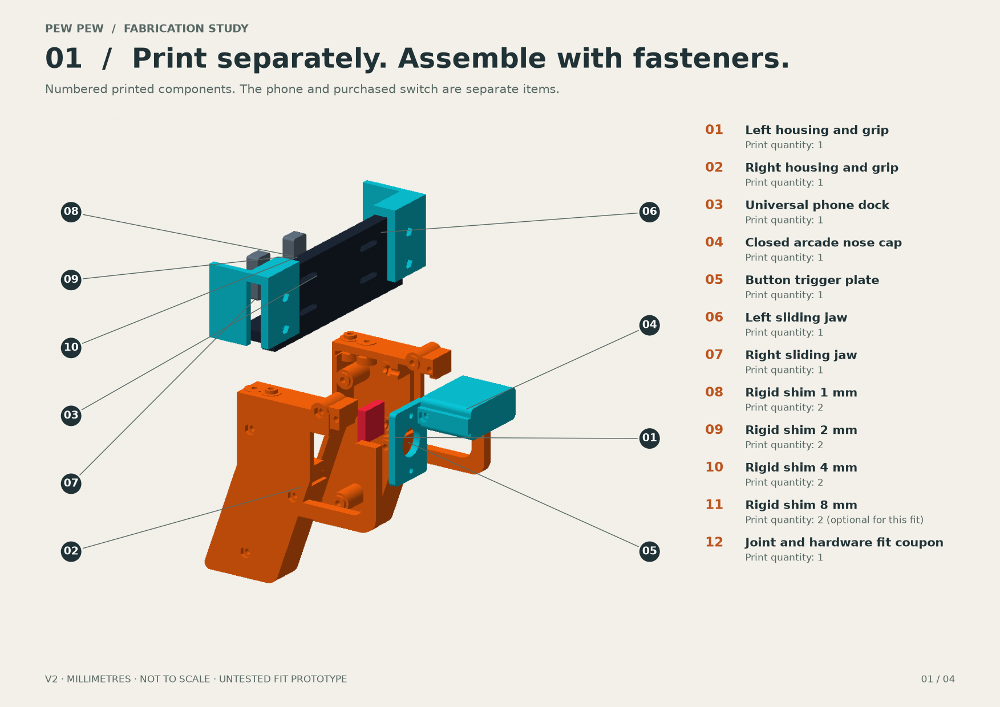

# PEW PEW — Modular arcade blaster / v2

**A kit of separate 3D-printable pieces, with bolted joints and a numbered assembly guide. Physical fit remains untested.**

The universal portrait phone dock sits above two hollow blaster shells. The closed nose cap and the momentary-button plate are separate, replaceable pieces. Sliding jaws and protective spacer stacks accommodate a target case-inclusive width of **65–90 mm** and thickness of **7–17 mm**. The phone supplies camera aim and the virtual laser; Bluetooth firing is a separate, unimplemented step.

## Start here

1. Read the [four-page fabrication drawing set](previews/fabrication-guide.pdf).
2. Follow the [joint design, hardware and assembly instructions](assembly-design.md).
3. Print the fit coupon and button plate first, then the required [individual STL parts](exports/), at millimetre scale and 100% size.

The kit has **12 STL part types**: two housing halves, phone dock, closed nose cap, button plate, two jaws, four shim thicknesses and one test coupon. The quantity of each shim depends on the phone/case thickness; printing every optional shim is unnecessary. Use the supplied quantities and selected assembly in the manifest.

The housing halves are oriented with cavities facing up, and the nose cap with its open rear facing up. This avoids the broad enclosed print of v1. Local pockets, holes and bridges still need inspection in the actual slicer. The parts do not come with G-code, a printer profile or generated supports.

## Files and formats

| File | Purpose |
|---|---|
| [Fabrication guide PDF](previews/fabrication-guide.pdf) | Numbered exploded drawing, individual part sizes/orientations, overall views and assembly sequence |
| [Assembly design](assembly-design.md) | Joint strategy, exact generated fastener map, hardware and first-print checks |
| [Individual STLs](exports/) | One separate model per printable part type; millimetres, already oriented for printing |
| [Assembly manifest](exports/assembly-manifest.json) | Part IDs, quantities, transforms, dimensions, fasteners and digital validation |
| [3D assembly](previews/blaster-assembly.glb) / [body only](previews/blaster-body.glb) | Viewing models in metres; these are not slicer layouts |
| [Parametric CAD source](cad/generate.py) | Regenerate the original geometry; Blender is optional |
| [Input proposal](integration-proposal.md) | Separate hardware-to-game integration handoff |

**Use the complete v2 kit.** The v0/v1 main body, cover, jaw fasteners and assembly instructions are incompatible. The earlier ZIP downloads are retained as history, while this folder contains the current revision.

## What to buy versus print

Print the plastic parts. Supply **15 M3 bolts** (four 40 mm, one 45 mm, ten 12 mm) and **15 M3 hex nuts**, matched to the fit coupon and fastener envelopes. Supply a **16 mm normally-open momentary pushbutton** with its own mounting nut, protective foam/silicone lining, thin shim restraint tape, a 15 mm hook-and-loop strap and an independent phone/case tether. Exact bolt head style and seating geometry are in the assembly design and manifest.

The purchased button supplies the click and spring return. A printed pivoting trigger paddle is not included. Reference button: [Adafruit 1505](https://www.adafruit.com/product/1505), previously checked for an overall envelope of about 18 × 18 × 29.4 mm. This does not certify its physical fit in the prototype.

## Regeneration

Use an isolated Python 3.12+ environment (tested on 3.14.5), install `cad/requirements.txt`, then run `python cad/generate.py`. Optional nominal assembly dimensions are `--phone-width 77 --phone-thickness 11 --phone-height 155`. Supported width is 65–90 mm; thickness is an integer 7–17 mm. Height changes the reference phone envelope only. Structural joint dimensions require CAD review when changed.

For the drawings and GLBs, also install `previews/requirements.txt`, then run `python previews/render_preview.py` and `python previews/build_fabrication_guide.py`. The latter also regenerates the [fastener coordinate map](fastener-map.md). Run `python previews/audit_print_geometry.py` for an independent STL read-back of flat bed contact and mesh integrity. Drawings are not to scale; their stated dimensions are read from the generated meshes.

## Evidence and limits

Digital validation is recorded in the generated manifest: exported mesh integrity, nominal part relationships and fit/clearance checks. Printed fit, retention, comfortable trigger reach, fastener durability and camera/UI access have not been demonstrated. Print the coupon and test with a dummy phone first. The lower dock and restraint strap can interfere with device buttons or the app UI; verify each actual phone/case combination.

No electronics, firmware, battery holder, charging design, Bluetooth connection or physical-device firing evidence is included. The application and targeting contracts remain unchanged. The [integration proposal](integration-proposal.md) records the separate next step.

This remains a Design exploration under technical-spec §23.4. Exclusive write set: `design/hardware/universal-controller/**`. It does not freeze a shared app slice.

## Earlier research

The prior Codex task **“Research China 3D-printed laser tag”** produced `phone-blaster-research.pdf` (dated September 2, 2026). It recommended DA LAB AR Shoot as the closest existing complete blaster and a compact original adjustable cradle for a Kill Zone-specific product.

On September 6, the [official DA LAB site](https://dalab.com.au/) still links its [digital print-file listing](https://www.etsy.com/listing/4471248244/ar-shoot-toy-gun-phone-mount-3d). Browser inspection now shows two ZIP files at CA$2.60 sale price (before any applicable tax). This resolves the report's inaccessible-listing price gap; the actual contents, editable source format and reuse terms remain uninspected. Nothing was purchased or downloaded. This is a current listing observation, not an offer or a compatibility claim.

AR Shoot advertises landscape phone use. The mainline Kill Zone app declares portrait orientation in `ios/VictoriaKillZone/VictoriaKillZone/Info.plist`, so this original v2 retains the portrait dock. The existing AR Shoot files need inspection before assuming they can fit the current app and camera direction. No AR Shoot mesh is part of this kit. The report's shortlist included DA LAB AR Shoot, a Nerf Laser Ops Pro phone holder, an AlphaPoint adapter, a SOLIDMaker3D trigger grip, an HJWWalters ESP32-CAM toy enclosure, and the iPega PG-9257 OEM lead. That research did not establish validated complete CAD or compatibility with this app. This kit uses original geometry; no third-party model has been copied into it.

Product authority: [technical specification, physical-shell concept](../../../victoria-kill-zone-technical-spec.md) and [ADR 0003](../../../docs/decisions/0003-multiplayer-first-refounding.md). The game remains a markerless phone-camera experience.
