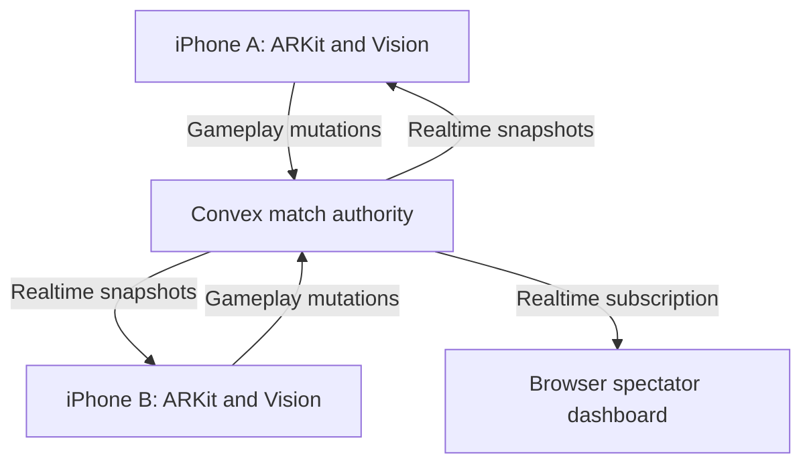

# Victoria Kill Zone

## Markerless AR Laser Tag — Eight-Hour Hackathon Technical Specification

**Document status:** Build-ready v1.0
**Target:** Working two-player iOS prototype, live spectator dashboard, and presentation
**Primary prize integration:** Convex realtime backend
**Prototype mode:** Markerless 1v1 Duel
**Working title:** Victoria Kill Zone (`VKZ`)

---

## 0. Amendments

Amendments override the sections they name. Everything not named here stands as written.

### A1 — Shared spatial hit registration is Phase 1 production scope

Authority: [ADR 0003](docs/decisions/0003-multiplayer-first-refounding.md) (accepted), [docs/roadmap.md](docs/roadmap.md) Phase 1, and the frozen packet in [docs/features/shared-spatial-hit-registration/requirements.md](docs/features/shared-spatial-hit-registration/requirements.md).

1. **Player count.** The product is multiplayer-first with a Phase 1 cap of **2–4 players**, per `match.v2`. The 1v1-only framing in the header, §1, §3, and §5.1 describes the original eight-hour prototype, not current scope. More than 4 players still requires a new accepted decision record.
2. **Placement.** A shared, host-defined, right-handed, metre-scaled, gravity-aligned ARKit arena frame, phone-proxy targets, and bounded rewind are **Phase 1 scope**, not post-MVP. This supersedes the placement of the shared ARKit coordinate system in §19 "P2: do not risk P0" and §23.1 "Post-MVP architecture". Those sections remain accurate as history and as the design sketch they were.
3. **Frozen semantics.** The 0.35 m phone-proxy sphere, the 3–15 m lane, the 250 ms rewind cap, the 100 ms maximum pose age, the fail-closed validation rules, host-provisional plus Convex-authoritative commitment, and the canonical player-visible copy are defined in the packet, which is the authority for all of them.
4. **Trigger authority — reaffirmed, not changed.** §5.3's rule that pressing the trigger without a valid zone under the crosshair displays a **miss** is carried into the shared-3D path unchanged and generalized: while the fire gates are open (match live, shooter alive, tracking normal, geofence permitting, ammunition, cooldown), a trigger press always produces exactly one shot from the current normalized camera ray. Proxy or zone detection is advisory targeting feedback only. A shot with no candidate is an authoritative miss that consumes ammunition and is recorded in the shot ledger; it is never suppressed input, and no surface may require a lock to fire.
5. **Firing model — reaffirmed, not changed.** The **hitscan with a visual tracer** decision in §3 and §5.3 stands, as does §5.4's reasoning for not simulating bullet velocity. The tracer is presentation of an instantaneous ray; it acquires no velocity, travel time, or swept collision in Phase 1, and §5.3's `projectileSpeedMetersPerSecond` stays `nil`. §23's persistent projectile worldlines and personal time remain later work.
6. **Shot presentation is shared.** §6.5's local muzzle and tracer feedback is joined by a transient incoming-shot tracer on every other member's phone, drawn from the shared-arena origin and direction and deduplicated by shot identity — including for misses. Confirmation reconciles the outcome without replaying the tracer.
7. **Fallback preserved.** The committed stack is unchanged, and the `shots:debugFire` path plus the screen-space Vision claim path remain in place until markerless spatial targeting replaces them with physical-device evidence.
8. **Not decided here.** Transform-disagreement tolerance, tracking-quality thresholds, pose cadence, transport, and authority relocation are deferred to KIL-20/21 and, where they change authority, to ADR 0004. Carrying the optional target into `shared/simulation`, where `ShotClaim.targetID` is still required, is KIL-22 shared-contract work with an Integration handoff — not KIL-19, which is an isolated iOS targeting/domain prototype that stops at shared-contract changes. `match.v2` already carries `targetId` as optional and the Convex fire path already resolves a no-target shot as a miss. Amendment A1 records no measurement and no anti-cheat claim.

---

## 1. Executive summary

Victoria Kill Zone turns two iPhones and a controlled outdoor space into a markerless augmented-reality laser-tag arena.

Each player looks through a live camera HUD with a crosshair, ammunition, health, kill/death count, match timer, and arena status. Apple Vision detects the opponent's body and estimates head, torso, and limb regions. ARKit supplies the shooter's real-time camera position and orientation, creating the firing ray. Convex acts as the authoritative match service, synchronizing player identity, health, ammunition, eliminations, respawns, geofence state, the shot ledger, and a browser-based spectator view.

The eight-hour prototype is intentionally a **1v1 markerless duel**. In a duel, the detected human is unambiguously the opponent. Markerless identification among three or more nearby people requires a shared AR coordinate system and spatial association; that is designed as the first post-MVP extension.

### One-sentence pitch

> Apple Vision understands the opponent, ARKit understands the shot, and Convex runs the battle.

### Honest prototype statement

The prototype uses on-device body-pose estimation and shooter-authoritative hit claims. It does not claim production-grade anti-cheat, anatomical precision, or Call of Duty-grade lag compensation.

---

## 2. Product goals

### 2.1 P0 hackathon goals

The prototype must demonstrate the following complete loop:

1. A host creates an arena centred on their current location.
2. A second player joins with a short match code.
3. Both players become ready and start a synchronized countdown.
4. Each phone displays a live camera shooter HUD.
5. The shooter's camera detects the opponent without a visible badge.
6. The crosshair can land on head and torso hit regions; limb regions are the first refinement after the core loop.
7. Firing consumes ammunition and creates immediate local feedback.
8. Convex validates the gameplay rules and applies damage atomically.
9. The target phone receives damage, haptics, and visual feedback.
10. A kill updates K/D and begins a timed respawn.
11. Leaving the arena disables the weapon.
12. A browser dashboard shows both players, health, score, arena position, and the live event feed.
13. Both phone perspectives are mirrored side-by-side during the presentation.

### 2.2 Success definition

The demo is successful if an audience can see this sequence twice without developer intervention:

> Acquire opponent → fire → target takes zone-specific damage → both phones and spectator dashboard agree → elimination → K/D update → respawn.

### 2.3 Non-goals for the eight-hour build

- Citywide open-world play.
- More than two simultaneously targetable players.
- Persistent user profiles or social graphs.
- Sign in with Apple, email, passwords, OAuth, Clerk, or Auth0.
- Production anti-cheat.
- Server-side frame-by-frame physics.
- Anatomically exact 3D body reconstruction.
- Simultaneous front- and rear-camera tracking.
- UWB as a required dependency.
- Browser delivery of live phone video through WebRTC.
- App Store submission.
- A physical gun shell.
- Realistic firearm visuals or props.

---

## 3. Product and technical decisions

| Decision | MVP choice | Reason |
|---|---|---|
| Targeting | Markerless Apple Vision body pose | Preserves the core product idea |
| Player count | 1v1 Duel | Avoids ambiguous visual identity |
| Firing model | Hitscan with a visual tracer | Responsive and appropriate for laser tag |
| Shooter pose | ARKit camera transform | Provides live origin and direction |
| Target body map | 2D joint-derived hit regions | Faster and more reliable than full 3D physics |
| Match authority | Convex mutations | Atomic health, ammo, score, and respawn state |
| High-frequency telemetry | Local only in P0 | Convex is not used as a 60 Hz physics server |
| Location | Core Location geofence | Coarse arena enforcement only |
| Player identity | Anonymous per-device session | No signup friction; still supports distinct players |
| Spectator display | Convex web dashboard | Visually demonstrates realtime multiplayer |
| Phone presentation | External mirroring into OBS | More reliable than building WebRTC in eight hours |
| Multiplayer extension | ARKit collaboration plus MultipeerConnectivity | Shared coordinates can associate bodies with player IDs |

---

## 4. Required hardware and preflight assumptions

### 4.1 Required

- One Apple-silicon or recent Intel Mac capable of running the required Xcode version.
- Two physical iPhones that can run the same minimum deployment target.
- Two data cables, even if wireless mirroring is planned.
- One Convex development deployment.
- Reliable Wi-Fi or cellular data for both phones.
- A controlled, well-lit test area with minimal unrelated foot traffic.
- An external display or projector for the final demo.

### 4.2 Recommended

- iPhone 12 or newer for better on-device vision performance.
- Outdoor arena with stable location readings.
- Reflector or another tested multi-device AirPlay receiver.
- OBS Studio for the split-screen presentation composition.
- A second Mac or capture fallback if simultaneous mirroring fails.

### 4.3 Thirty-minute preflight gate

Do not begin feature work until all of these pass:

- A blank signed app launches on both physical iPhones.
- Camera and location permissions work on both devices.
- Both devices can reach the Convex deployment.
- A test mutation from each device appears in the Convex dashboard.
- The web spectator shell subscribes to a test query.
- At least one reliable mirroring route has been proven for each phone.

If the gate fails, fix provisioning, networking, or hardware before building UI.

---

## 5. Game design

### 5.1 Mode: Duel

- Players: exactly two active players.
- Match length: 180 seconds.
- Arena radius: 30 metres by default; host-selectable from 20–60 metres.
- Starting health: 100.
- Magazine size: 8.
- Fire cooldown: 150 milliseconds (ADR 0007; 400 RPM ceiling).
- Reload duration: 1.25 seconds.
- Respawn delay: 5 seconds.
- Win condition: most kills when the timer ends.
- Tie: fewest deaths, then most total damage.

### 5.2 Damage model

| Zone | Damage | Intended result |
|---|---:|---|
| Head | 75 | A high-value precision shot |
| Torso | 34 | Three-shot elimination |
| Limbs | 20 | Five-shot elimination |

Damage values are configuration, not constants distributed through the UI.

### 5.3 Weapon behaviour

- P0 weapon is a hitscan energy weapon.
- Pressing the trigger immediately evaluates the latest valid pose snapshot.
- A local laser tracer animates from the crosshair toward the target region.
- Weapon fire is rejected locally and by Convex while:
  - dead;
  - reloading;
  - out of the arena;
  - out of ammunition;
  - still inside the fire cooldown;
  - camera/body tracking is unavailable.
- The app displays a miss if the trigger is pressed without a valid zone under the crosshair.

### 5.4 Why the MVP does not simulate bullet velocity

Projectile speed changes travel time; it does not solve human recognition or identity. Across a small laser-tag arena, hitscan is responsive, easy to validate, and thematically correct.

The weapon contract must still anticipate later projectiles:

```swift
struct WeaponDefinition: Codable, Equatable {
    let id: String
    let damageByZone: [HitZone: Int]
    let roundsPerMinute: Double
    let magazineSize: Int
    let reloadDurationMs: Int
    let projectileSpeedMetersPerSecond: Double? // nil = hitscan
}
```

P1 projectile mode can send `{ origin, direction, speed, firedAt }`, retain short pose histories, interpolate the target hitbox at the projectile arrival time, and introduce lag compensation. That system does not belong on the critical path.

---

## 6. User journeys

### 6.1 First launch

1. App creates or reads a random device identifier from Keychain.
2. Player enters a short display name.
3. App requests camera permission.
4. App requests foreground precise location permission.
5. Player reaches the home screen.

### 6.2 Create arena

1. Host taps **Create Duel**.
2. App reads the current location and accuracy.
3. Host selects a radius or accepts 30 metres.
4. Convex creates the match and host player atomically.
5. Host sees a six-character join code.
6. Host enters the lobby and marks ready.

### 6.3 Join arena

1. Guest taps **Join Duel**.
2. Guest enters the join code and display name.
3. Convex validates that the match is in the lobby and has one open slot.
4. Guest receives an anonymous player session.
5. Both players see each other in the lobby.

### 6.4 Vision readiness check

1. Players stand approximately 3–8 metres apart.
2. Each player points their rear camera at the other player.
3. Vision readiness turns green when a human pose with required joints is detected.
4. Both players mark ready.
5. Host starts the match.

This is a camera/lighting validation, not a player-marker calibration.

### 6.5 Playing

1. Synchronized `3, 2, 1` countdown.
2. Camera HUD becomes active.
3. Crosshair changes from white to amber when a body is detected.
4. Crosshair changes to red when it intersects a damage zone.
5. Trigger creates local muzzle, tracer, sound, and haptic feedback.
6. Convex returns the authoritative shot outcome.
7. Target sees a red directional flash and health change.

### 6.6 Death and respawn

1. Target health reaches zero in the same mutation that credits the kill.
2. Target enters `dead` state and weapon input locks.
3. Death screen shows killer, hit zone, and countdown.
4. The elimination mutation schedules the target's respawn.
5. After five seconds, a scheduled internal mutation restores health and ammunition.

### 6.7 Match end

1. Convex ends the match when the timer expires or host ends early.
2. Both phones display the final scoreboard.
3. Spectator dashboard displays the winner and match statistics.

---

## 7. Screen specification

Figma should contain only the screens and states needed for implementation.

### 7.1 Home

- Logo/wordmark: `VKZ` or `Victoria Kill Zone`.
- Display-name input.
- Primary action: **Create Duel**.
- Secondary action: **Join Duel**.
- Small permission/device status.

### 7.2 Create arena

- Map centred on current position.
- Radius circle and slider: 20–60 metres.
- Location accuracy status.
- **Create Arena** button.

### 7.3 Join

- Six-character code input.
- **Join Arena** button.
- Clear error states: invalid code, full, already running, offline.

### 7.4 Lobby

- Match code.
- Two player slots and ready state.
- Arena radius and location status.
- Vision readiness status.
- Host-only **Start Duel** button.

### 7.5 Shooter HUD

- Full-screen rear camera.
- Fixed centre crosshair.
- Health: top-left.
- Match time: top-centre.
- K/D: top-right.
- Ammo and reload: bottom-right.
- Large transparent trigger region: lower half or right edge.
- Arena status: small bottom-centre pill.
- Connection indicator.
- Damage-direction flash around screen edges.
- Target state: `SEARCHING`, `BODY LOCK`, or zone name.

### 7.6 Dead/respawning overlay

- `ELIMINATED`.
- Killer name.
- Hit zone.
- Respawn countdown.
- Score summary.

### 7.7 Final scoreboard

- Winner.
- Kills, deaths, damage, accuracy, headshots.
- **Play Again** and **Leave**.

### 7.8 Spectator dashboard

- Two player cards with health, ammunition, K/D, and connection state.
- Arena radar with player position and heading.
- Match timer and phase.
- Animated event feed.
- Recent-shot indicators.
- Winner state.

### 7.9 Visual direction

- Dark background and high-contrast HUD.
- White primary typography.
- Cyan for neutral telemetry.
- Amber for acquired target.
- Red for valid shot/damage/danger.
- Green for ready/connected.
- Monospaced numeric labels.
- Minimal military styling; avoid realistic firearm iconography.

Figma work is time-boxed to 30 minutes. Backend and camera work begin from this written contract before final visual approval.

---

## 8. System architecture



### 8.1 Responsibility boundaries

| Component | Owns |
|---|---|
| iOS targeting engine | Camera frames, body pose, hit regions, crosshair intersection |
| iOS AR session | Shooter camera transform, heading, local motion |
| iOS game client | Optimistic effects, input, subscriptions, HUD state |
| Core Location | Arena membership estimate and spectator position |
| Convex | Match phase, player sessions, health, ammo, score, shot ledger, respawn |
| Spectator web app | Read-only visualization of match state |
| MultipeerConnectivity | P1 shared spatial transforms; not required for P0 |
| OBS/mirroring tools | Presentation-only dual-phone video |

### 8.2 Networking principle

Do not send camera frames, Vision joints, or 60 Hz motion updates to Convex.

Convex receives discrete gameplay events and reduced telemetry:

- Shots: immediately.
- Lobby, ready, start, end: immediately.
- Damage, death, reload, respawn: immediately.
- Location and heading: approximately 2–5 Hz, throttled and coalesced.
- Presence heartbeat: every 5 seconds.

---

## 9. iOS technical architecture

### 9.1 Stack

- Swift.
- SwiftUI for application screens and HUD overlay.
- ARKit for rear-camera session and camera transform.
- Vision for human body-pose observations.
- Core Location for geofence evaluation.
- Core Motion only if additional angular-velocity filtering is needed.
- AVFoundation/AudioToolbox for sound.
- UIKit haptics through `UIImpactFeedbackGenerator` and `UINotificationFeedbackGenerator`.
- Convex Swift client for subscriptions and mutations.
- Keychain for anonymous device/session material.

### 9.2 Suggested module structure

```text
ios/VictoriaKillZone/
  App/
    VictoriaKillZoneApp.swift
    AppEnvironment.swift
  Models/
    GameModels.swift
    NetworkModels.swift
    TargetingModels.swift
  Services/
    ConvexGameClient.swift
    LocationService.swift
    SessionIdentityStore.swift
    AudioHapticsService.swift
  Targeting/
    ARCameraController.swift
    VisionPoseDetector.swift
    HitRegionBuilder.swift
    TargetingEngine.swift
  Features/
    Home/
    Arena/
    Lobby/
    Game/
    Results/
  DesignSystem/
    Colors.swift
    Typography.swift
    Components/
```

### 9.3 Core client models

```swift
enum MatchPhase: String, Codable {
    case lobby, countdown, running, finished, cancelled
}

enum PlayerLifeState: String, Codable {
    case alive, dead, respawning, disconnected
}

enum HitZone: String, Codable, CaseIterable {
    case head, torso, limbs
}

struct Arena: Codable, Equatable {
    let latitude: Double
    let longitude: Double
    let radiusMeters: Double
}

struct PlayerSnapshot: Codable, Identifiable, Equatable {
    let id: String
    let displayName: String
    let health: Int
    let ammo: Int
    let kills: Int
    let deaths: Int
    let lifeState: PlayerLifeState
    let latitude: Double?
    let longitude: Double?
    let headingDegrees: Double?
    let locationAccuracyMeters: Double?
    let lastSeenAt: Double
}

struct MatchSnapshot: Codable, Equatable {
    let id: String
    let code: String
    let phase: MatchPhase
    let arena: Arena
    let startsAt: Double?
    let endsAt: Double?
    let players: [PlayerSnapshot]
}
```

---

## 10. Markerless targeting specification

### 10.1 Frame pipeline

1. ARKit runs the camera session.
2. `ARSessionDelegate` receives updated frames.
3. Vision processing is throttled initially to 8–12 requests per second.
4. Only one Vision request may be in flight.
5. The detector discards late results if a newer valid pose is already available.
6. Vision normalized coordinates are transformed into displayed camera-view coordinates, accounting for orientation and aspect-fill crop.
7. The targeting engine stores the newest `PoseSnapshot`.
8. SwiftUI renders debug hit regions only in debug builds.

### 10.2 Pose snapshot

```swift
struct JointObservation: Equatable {
    let point: CGPoint
    let confidence: Float
}

struct PoseSnapshot: Equatable {
    let capturedAt: TimeInterval
    let joints: [String: JointObservation]
    let bodyBounds: CGRect
    let overallConfidence: Float
}

struct AimSolution: Equatable {
    let capturedAt: TimeInterval
    let zone: HitZone
    let confidence: Float
    let crosshairPoint: CGPoint
}
```

### 10.3 Joint requirements

Attempt to read:

- nose;
- left/right eye;
- left/right ear;
- neck;
- left/right shoulder;
- left/right elbow;
- left/right wrist;
- root/hips;
- left/right hip;
- left/right knee;
- left/right ankle.

Ignore points below their zone-specific confidence threshold.

### 10.4 Head region

Primary construction:

1. Collect visible eyes, ears, and nose with confidence at least `0.6`.
2. Estimate the centre from the mean of valid facial joints.
3. Calculate shoulder distance when both shoulders are valid.
4. Create an ellipse around the centre using shoulder distance as scale.

Fallback construction:

1. Require neck and both shoulders.
2. Calculate shoulder midpoint and shoulder distance.
3. Place the head centre above the neck by approximately `0.32 × shoulderDistance`.
4. Use radii approximately `0.24 × shoulderDistance` horizontally and `0.32 × shoulderDistance` vertically.

These are tunable defaults, not anatomical claims.

### 10.5 Torso region

Preferred polygon:

```text
left shoulder → right shoulder → right hip → left hip
```

If one hip is missing, estimate the lower torso from shoulder width and the visible root/hip point. Require at least both shoulders plus one lower-body anchor.

### 10.6 Limb regions

Build screen-space capsules around valid segments:

- shoulder → elbow;
- elbow → wrist;
- hip → knee;
- knee → ankle.

Capsule width is proportional to shoulder distance and clamped to sensible minimum and maximum screen widths.

### 10.7 Hit-test rules

- Crosshair is the exact centre of the rendered camera viewport.
- The latest pose must be no older than 200 milliseconds.
- Zone priority when regions overlap: head, torso, limbs.
- Head solution confidence must be at least `0.6`.
- Torso/limb solution confidence must be at least `0.45`.
- A hit requires the crosshair to remain in the same zone for at least two recent pose results or approximately 80 milliseconds.
- Optional motion guard rejects a shot during extreme angular velocity.
- No body region under the crosshair means miss.
- In P0 Duel, the detected human maps to the only other player.

If Vision returns multiple observations, score candidates by usable-joint confidence, body-bounds area, and proximity to the crosshair. Use the highest-scoring observation and expose the selection in the debug overlay. The controlled demo lane should still minimize unrelated people in frame.

### 10.8 Shooter ray

ARKit provides the current camera transform. The firing ray is:

```text
origin = camera world translation
direction = normalized negative camera Z axis
timestamp = current monotonic time
```

The P0 hit decision remains a screen-space intersection because it is robust without requiring depth. The ray is retained in the shot telemetry and animation contract for future 3D spatial validation.

### 10.9 Face detection

Face detection may refine the head ellipse when the face is visible, but it must never be required:

- The opponent may face away.
- The face may be occluded.
- Lighting may prevent stable landmarks.
- Running a second Vision request may reduce frame rate.

Do not use the target player's front camera in P0. The rear camera is already required for that player to aim, and simultaneous multi-camera capture adds device and integration risk.

### 10.10 Performance rules

- Never perform Vision requests on the main thread.
- Maintain at most one in-flight request.
- Start at 10 Hz; tune only after profiling on both demo phones.
- Render HUD at display refresh rate using the latest pose snapshot.
- Reuse request objects and buffers when possible.
- Reduce Vision frequency before reducing camera/HUD responsiveness.
- Add a debug overlay showing joints, hit regions, confidence, and pose age.

---

## 11. Anonymous identity and session security

### 11.1 Important distinction

The prototype skips permanent accounts, not player identity.

Each physical phone has a stable anonymous device identity and receives a match-scoped player session.

### 11.2 Device identity

On first launch:

1. Generate a cryptographically random device ID.
2. Store it in Keychain.
3. Never display it.

### 11.3 Match-scoped session

On create or join:

1. Client generates a random 256-bit session secret.
2. Client sends its hash, device ID hash, and display name to Convex.
3. Convex creates a player record and returns the player document ID.
4. Client stores `{ matchId, playerId, sessionSecret }` in Keychain for reconnect.
5. Every player mutation sends the secret.
6. Convex hashes the supplied secret and compares it to the stored hash.

Public spectator queries never return secret material or device identifiers.

Use `SecRandomCopyBytes` on iOS for secret generation and CryptoKit SHA-256 for the client hash. On the backend, use a deterministic pure-JavaScript SHA-256 implementation compatible with the Convex runtime, such as `@noble/hashes`; do not depend on Node-only `crypto` APIs inside standard Convex mutations.

### 11.4 Production path

Replace the prototype session scheme with Sign in with Apple or a supported authentication provider when persistent profiles, moderation, or anti-cheat become product requirements.

---

## 12. Convex backend specification

### 12.1 Role of Convex

Convex is authoritative for:

- match existence and phase;
- arena configuration;
- player membership;
- health;
- ammunition;
- fire cooldown;
- reload state;
- kills and deaths;
- respawn timing;
- shot idempotency and ledger;
- live spectator state;
- winner calculation.

Convex is not authoritative for raw computer-vision evidence in P0. The shooter submits a hit claim generated on-device. This limitation must be stated in the presentation if asked about anti-cheat.

### 12.2 Suggested schema

#### `matches`

```ts
{
  code: string,
  phase: "lobby" | "countdown" | "running" | "finished" | "cancelled",
  hostPlayerId: Id<"players">,
  centerLatitude: number,
  centerLongitude: number,
  radiusMeters: number,
  maxPlayers: number,
  durationMs: number,
  countdownStartsAt?: number,
  startsAt?: number,
  endsAt?: number,
  winnerPlayerId?: Id<"players">,
  createdAt: number,
  updatedAt: number
}
```

Indexes:

- `by_code`
- `by_phase`

#### `players`

```ts
{
  matchId: Id<"matches">,
  displayName: string,
  deviceIdHash: string,
  sessionHash: string,
  role: "host" | "guest",
  ready: boolean,
  connected: boolean,
  lifeState: "alive" | "dead" | "respawning" | "disconnected",
  health: number,
  ammo: number,
  kills: number,
  deaths: number,
  damageDealt: number,
  shotsFired: number,
  shotsHit: number,
  headshots: number,
  lastShotAt?: number,
  reloadEndsAt?: number,
  respawnAt?: number,
  latitude?: number,
  longitude?: number,
  locationAccuracyMeters?: number,
  headingDegrees?: number,
  locationAt?: number,
  lastSeenAt: number,
  joinedAt: number
}
```

Indexes:

- `by_match`
- `by_match_and_device`

#### `shots`

```ts
{
  matchId: Id<"matches">,
  shooterId: Id<"players">,
  targetId?: Id<"players">,
  clientShotId: string,
  zone?: "head" | "torso" | "limbs",
  damage: number,
  outcome: "miss" | "hit" | "kill" | "rejected",
  rejectReason?: string,
  origin?: number[],
  direction?: number[],
  poseConfidence?: number,
  firedAtClient: number,
  createdAt: number
}
```

Indexes:

- `by_match_and_created_at`
- `by_shooter_and_client_shot_id`

#### `events`

```ts
{
  matchId: Id<"matches">,
  type: "joined" | "ready" | "started" | "shot" | "hit" |
        "eliminated" | "respawned" | "out_of_zone" | "finished",
  actorPlayerId?: Id<"players">,
  targetPlayerId?: Id<"players">,
  zone?: "head" | "torso" | "limbs",
  damage?: number,
  message: string,
  createdAt: number
}
```

Index:

- `by_match_and_created_at`

### 12.3 Public functions

| Function | Type | Purpose |
|---|---|---|
| `matches:create` | mutation | Create match and host player atomically |
| `matches:join` | mutation | Join open duel and create guest player |
| `matches:setReady` | mutation | Update ready state |
| `matches:start` | mutation | Validate two ready players, start countdown, and schedule activation/end |
| `matches:end` | mutation | Host/admin end early |
| `players:heartbeat` | mutation | Update presence and reduced telemetry |
| `players:startReload` | mutation | Validate reload and schedule refill |
| `shots:fire` | mutation | Validate and atomically resolve a shot |
| `queries:matchSnapshot` | query | Sanitized phone snapshot |
| `queries:spectatorSnapshot` | query | Sanitized spectator state and recent events |

Required scheduled internal mutations:

- `internal.matches:activate` changes countdown to running.
- `internal.matches:finish` calculates the winner and ends the match.
- `internal.players:completeReload` refills the magazine if the reload is still valid.
- `internal.players:respawn` restores health, ammunition, and alive state after an elimination.

### 12.4 Shot request

```ts
type FireShotArgs = {
  matchId: Id<"matches">;
  shooterId: Id<"players">;
  sessionSecret: string;
  clientShotId: string;
  targetId?: Id<"players">;
  zone?: "head" | "torso" | "limbs";
  poseConfidence?: number;
  origin?: [number, number, number];
  direction?: [number, number, number];
  firedAtClient: number;
};

type FireShotResult = {
  accepted: boolean;
  outcome: "miss" | "hit" | "kill" | "rejected";
  rejectReason?: string;
  damage: number;
  shooterAmmo: number;
  targetHealth?: number;
  targetLifeState?: "alive" | "dead" | "respawning";
};
```

### 12.5 `shots:fire` validation order

1. Validate argument shapes.
2. Authenticate shooter session.
3. Check shot idempotency by `{ shooterId, clientShotId }`.
4. Load match, shooter, and target.
5. Require match phase `running` and current time before `endsAt`.
6. Require shooter membership, connection, and alive state.
7. Require fresh in-zone location or an explicit hackathon admin override.
8. Require ammunition greater than zero.
9. Require fire cooldown elapsed.
10. For a claimed hit, require the target to be the only other match player.
11. Require target alive and not respawning.
12. Clamp damage to server-owned zone configuration.
13. Decrement ammunition and increment shots fired.
14. Apply target damage when valid.
15. On zero health, increment shooter kills and target deaths in the same mutation.
16. Set target respawn time and schedule the internal respawn mutation.
17. Insert the shot and event records.
18. Return the authoritative outcome.

Never trust client-provided damage values.

### 12.6 Match and reload timing

- `matches:start` sets `phase = countdown`, records `startsAt`, and schedules `internal.matches:activate` after the three-second countdown.
- Activation sets `phase = running`, records `endsAt`, and schedules `internal.matches:finish` after the configured duration.
- `players:startReload` records `reloadEndsAt` and schedules `internal.players:completeReload` after 1.25 seconds.
- An elimination records `respawnAt` and schedules `internal.players:respawn` after five seconds.
- Each internal mutation rereads current state and exits harmlessly if the match/player has changed, making delayed jobs safe.
- Public gameplay mutations defensively reject actions after `endsAt` even if a scheduled job is briefly delayed.

---

## 13. Geofence specification

### 13.1 Role

The geofence controls whether the weapon is enabled. It does not participate in aiming or body-zone detection.

### 13.2 Evaluation

- Compute distance from the match centre with the Haversine formula.
- Request precise foreground location.
- Publish location at 2–5 Hz only when meaningfully changed.
- Treat very inaccurate readings as `uncertain`, not immediately outside.
- Require two consecutive accurate outside samples before locking the weapon.
- Use approximately 5 metres of hysteresis to prevent boundary flapping.

### 13.3 Suggested states

| State | Behaviour |
|---|---|
| `inside` | Weapon enabled |
| `warning` | Near boundary; amber warning |
| `uncertain` | Poor accuracy; display warning and retain last trusted state briefly |
| `outside` | Weapon locked |

### 13.4 Indoor fallback

If the hackathon demo is indoors and location accuracy is unusable:

- Keep the arena creation and map experience.
- Add a clearly labelled demo-only geofence override controlled by the host.
- Do not pretend indoor GPS is precise.

---

## 14. Realtime client behaviour

### 14.1 Local prediction

On trigger press, immediately play:

- muzzle/laser effect;
- sound;
- light haptic;
- local ammunition decrement animation;
- hit marker only when a local aim solution exists.

The authoritative subscription may correct the local state if Convex rejects the shot.

### 14.2 Target feedback

When the subscribed player health decreases:

- play heavy haptic;
- flash screen edges red;
- display zone and damage briefly;
- update health animation;
- show death overlay if life state changes.

### 14.3 Connection behaviour

- Show `CONNECTING` when the Convex WebSocket is not connected.
- Disable start while either player is disconnected.
- During a running match, retain camera UI but lock firing if authoritative state is stale beyond a configured threshold.
- Reconnect with the stored anonymous match session.

---

## 15. Spectator dashboard

### 15.1 Stack

- React.
- TypeScript.
- Vite.
- Convex React client.
- SVG or Canvas radar; no paid mapping token required.
- CSS animations; avoid a heavy charting library.

### 15.2 Radar conversion

Convert each player's latitude/longitude into local east/north metre offsets from the arena centre, then normalize by the radius:

```text
x = eastMeters / radiusMeters
y = northMeters / radiusMeters
```

Clamp visual dots to the arena edge and rotate the player arrow by heading.

### 15.3 Required display

- Match code and phase.
- Countdown/timer.
- Both player names.
- Health and ammunition.
- K/D.
- Arena radar.
- Last 10–20 events.
- Connection/presence state.
- Winner overlay.

### 15.4 Read-only rule

The spectator application uses sanitized queries and must not possess player session secrets or mutation privileges.

---

## 16. Dual-POV presentation system

### 16.1 Desired composition

```text
┌──────────────────────┬──────────────────────┐
│ Player One POV       │ Player Two POV       │
│ camera + HUD         │ camera + HUD         │
├──────────────────────┴──────────────────────┤
│ Convex radar, health, K/D, and event feed   │
└─────────────────────────────────────────────┘
```

### 16.2 Implementation

- Use OBS as the compositor.
- Prefer a proven multi-device AirPlay receiver.
- Maintain a wired fallback:
  - one phone through QuickTime/USB;
  - one phone through AirPlay or another receiver.
- Do not depend on Apple's iPhone Mirroring app for two phones; it is designed around one iPhone connection at a time.
- Record a 30–60 second backup demonstration before judging begins.

### 16.3 No WebRTC requirement

The spectator browser does not need to contain live phone video. Building ReplayKit capture, an upload extension, WebRTC signalling, STUN/TURN, and browser playback is a P2 feature.

---

## 17. Repository and interface ownership

```text
victoria-kill-zone/
  ios/
  convex/
  spectator/
  docs/
    technical-spec.md
    demo-script.md
    presentation-outline.md
  design/
    figma-links.md
  README.md
  package.json
  pnpm-workspace.yaml
```

Recommended ownership during parallel work:

| Owner | Exclusive paths |
|---|---|
| Integration lead | repository root, shared docs, Xcode project settings |
| iOS targeting agent | `ios/.../Targeting/` and targeting tests |
| Convex agent | `convex/` |
| Spectator agent | `spectator/` |
| Design/presentation agent | Figma and `docs/presentation-outline.md` |

Agents must not edit another agent's exclusive paths without handoff.

---

## 18. Eight-hour build schedule

| Time | Gate | Required outcome |
|---|---|---|
| 0:00–0:30 | Hardware gate | Signed shell app on both phones; Convex and mirroring proven |
| 0:30–1:00 | Contract gate | Schema, models, UI frames, repo ownership frozen |
| 1:00–2:15 | Network vertical slice | Create/join/start and manual shot changes target health |
| 2:15–3:45 | Vision gate | Crosshair identifies head/torso/limbs on a physical device |
| 3:45–4:45 | Gameplay loop | Ammo, reload, damage, kill, K/D, respawn |
| 4:45–5:30 | Arena gate | Geofence state and reduced telemetry work outdoors |
| 5:30–6:15 | Spectator gate | Radar, score, health, and event feed update live |
| 6:15–6:50 | Presentation gate | Both phone POVs and dashboard composed on projector Mac |
| 6:50–7:20 | Polish | Haptics, sound, animations, error states |
| 7:20–8:00 | Freeze | No new features; test, record backup, rehearse, finish slides |

### 18.1 Mandatory freeze rule

At 7:20, stop implementing features. Only fix demo-blocking defects.

---

## 19. Priority ladder and degradation plan

### P0: must work

- Two physical iPhones.
- Anonymous player sessions.
- Create/join/start duel.
- Convex subscriptions.
- Manual shot mutation.
- Markerless body detection.
- Head and torso hit detection.
- Health, ammo, kill, death, respawn.
- Dual POV presentation.
- Spectator health/score/event updates.

### P1: implement after P0

- Head and limb refinement.
- Geofence hysteresis.
- Radar heading arrows.
- Aim-stability filter.
- Match statistics.
- Visual/audio polish.

### P2: do not risk P0

- Shared ARKit coordinate system.
- Three-to-four-player targeting.
- UWB.
- Projectile velocity and lag compensation.
- Live WebRTC phone streaming.
- Persistent accounts.
- Citywide play.

### Degradation order

If behind schedule, cut in this order:

1. Face refinement; keep the pose-derived head fallback.
2. Limb-specific geometry; keep head and torso.
3. Heading on spectator radar.
4. Reload animation; retain reload rules.
5. Geofence UI polish.
6. Head region; keep markerless torso hit.

Never cut the two-phone network loop, Convex authority, or markerless body detection.

---

## 20. Test plan

### 20.1 Convex unit tests

- Cannot join a full duel.
- Cannot start without two ready players.
- Cannot fire before match start.
- Duplicate `clientShotId` does not apply damage twice.
- Ammo never becomes negative.
- Cooldown rejects rapid fire.
- Client cannot supply arbitrary damage.
- Hit and kill update all related records atomically.
- Dead player cannot shoot.
- Respawn before `respawnAt` is rejected.
- Session secret cannot control another player.
- Spectator query does not expose session/device secret fields.

### 20.2 Targeting tests

- Coordinate transformation handles portrait orientation and aspect-fill crop.
- Head ellipse is derived correctly from valid facial points.
- Head fallback works from neck and shoulders.
- Torso polygon rejects points outside the body.
- Limb capsule includes the segment and rejects distant points.
- Zone priority is head over torso over limbs.
- Stale poses do not create hits.
- Low-confidence points are ignored.

### 20.3 Physical-device scenarios

- Front-facing opponent in bright light.
- Opponent facing sideways.
- Opponent facing away.
- Partial-body framing.
- Opponent at 3, 5, and 8 metres.
- Fast pan followed by stable aim.
- One unrelated person in the background.
- Temporary network disconnect.
- Boundary exit and re-entry.
- Full kill/respawn loop five consecutive times.

### 20.4 Demo soak test

Run ten consecutive three-shot sequences on both phones. The build is demo-ready when:

- no crash occurs;
- no duplicate damage occurs;
- health agrees across both phones and dashboard;
- body detection reacquires reliably;
- devices do not become thermally unusable;
- mirrored views remain stable.

---

## 21. Risks and mitigations

| Risk | Impact | Mitigation |
|---|---|---|
| Vision misses moving person | No hit acquisition | Controlled lighting, 3–8 m duel lane, throttle/tune confidence |
| Multiple people visible | Wrong target in 1v1 | Clear demo lane; use most prominent valid pose |
| Coordinate conversion bug | Crosshair/hitbox mismatch | Debug overlay and deterministic transformation tests |
| Vision blocks UI | Choppy HUD | Background processing, one in-flight request, 8–12 Hz |
| GPS inaccurate indoors | False arena lock | Outdoor test or explicit host demo override |
| Convex Swift integration issue | No multiplayer | Prove mutation/subscription in first 30 minutes |
| Code signing issue | Cannot test | Provision both devices before feature development |
| Wireless mirroring fails | Weak presentation | Wired fallback and pre-recorded backup |
| Phone overheats | Vision degrades | Lower Vision frequency and screen brightness |
| Client-authoritative hit cheating | Production limitation | Disclose honestly; target confirmation is post-MVP |
| Shared-world multiplayer drifts | Wrong identity | Keep shared coordinates out of P0 |

---

## 22. Safety and privacy

- Play only in a controlled, authorized area.
- Do not point realistic gun-shaped props in public.
- Any future phone mount must be brightly coloured and unmistakably fictional.
- Show a pre-match safety warning about obstacles, roads, stairs, and bystanders.
- Require players to stop moving while looking away from their walking path.
- Store only the location data required for the active match.
- Do not expose exact historical player locations in public spectator queries.
- Delete or expire prototype match telemetry after a reasonable period.

---

## 23. Post-MVP architecture

### 23.1 Markerless multiplayer

For three or more players:

1. Enable ARKit collaborative sessions.
2. Exchange collaboration data with MultipeerConnectivity.
3. Align devices to a shared world map.
4. Broadcast each player's AR camera transform and player ID at 10–20 Hz over the local peer channel.
5. Project expected player positions into the shooter's view.
6. Associate each Vision skeleton with the nearest plausible projected player.
7. Use Convex for authoritative match state and spectator history.

### 23.2 Target confirmation

For stronger anti-cheat:

1. Shooter sends shot origin, direction, timestamp, and claimed zone to target peer.
2. Target retains a short pose/transform history.
3. Target independently evaluates whether the shot intersects its estimated body volume.
4. Convex applies damage only after compatible shooter claim and target confirmation.

### 23.3 UWB

Nearby Interaction can provide relative distance and direction between supported devices. It may help disambiguate close players but should augment, not replace, visual body detection and shared spatial mapping.

### 23.4 Physical shell

Future concept:

- phone docks into a bright arcade-like grip;
- physical trigger sends input over Bluetooth or a simple accessory connection;
- haptic motor provides recoil;
- optional UWB module improves relative positioning;
- design must be visibly a toy, not a realistic firearm.

### 23.5 Open-world mode

Citywide play is an opt-in discovery layer, not continuous public shooting:

- coarse geocells discover events and drops;
- players enter explicit safe battle zones;
- GPS discovers proximity;
- Vision/shared spatial tracking confirms actual combat;
- no realistic props in public;
- ammo drops and events are Convex-managed records.

---

## 24. Presentation outline

### Slide 1 — The idea

**Turn any controlled field into a multiplayer AR arena.**

### Slide 2 — The problem

Laser tag requires specialized venues and hardware. Mobile AR games rarely make nearby people part of the live game world.

### Slide 3 — The live demonstration

Show both phone perspectives and the Convex spectator command centre. Perform torso damage, a headshot, an elimination, and a respawn.

### Slide 4 — How it works

- Vision: markerless body and hit regions.
- ARKit: real-time firing direction.
- Convex: authoritative multiplayer state.

### Slide 5 — Why Convex

- Atomic shot resolution.
- Automatic realtime subscriptions.
- Shared phone and browser state.
- Persistent shot/event ledger.
- Fast spectator experience without custom socket infrastructure.

### Slide 6 — Product future

- Shared-world multiplayer.
- UWB wearables.
- Bright haptic phone shell.
- Safe event-scale arenas.
- Opt-in location-based drops and tournaments.

### Closing line

> Today we made two phones understand a battlefield. Next, we turn the whole event into one.

---

## 25. Demo script

1. Presenter introduces the markerless 1v1 arena.
2. Player One creates a 30-metre duel.
3. Player Two joins with the code.
4. Spectator dashboard shows both players.
5. Players ready and countdown begins.
6. Player One aims at Player Two's torso and fires.
7. Audience sees damage on both POVs and dashboard.
8. Player Two returns fire and demonstrates ammunition/reload.
9. Player One lands a headshot/elimination.
10. Dashboard updates K/D and event feed.
11. Player Two respawns.
12. Presenter explains the shared-world/UWB and haptic-shell roadmap.

Keep the live demonstration under two minutes.

---

## 26. Open decisions with safe defaults

| Question | Default if unanswered |
|---|---|
| Exact iPhone models | Support the older of the two demo devices |
| Indoor or outdoor | Develop outdoors; add demo override for indoor judging |
| Public brand | Display `VKZ`; explain Victoria Kill Zone verbally |
| Phone posture | Two-handed, phone held near eye level |
| Visual style | Black, white, cyan, amber, red |
| Vision frequency | Start at 10 Hz |
| Arena radius | 30 metres |
| Match duration | 180 seconds |

---

## 27. Primary technical references

- [Apple Vision: Detecting Human Body Poses](https://developer.apple.com/documentation/vision/detecting-human-body-poses-in-images)
- [Apple Vision: 3D Body Pose and Person Segmentation](https://developer.apple.com/videos/play/wwdc2023/111241/)
- [Apple ARKit: Creating a Collaborative Session](https://developer.apple.com/documentation/arkit/creating-a-collaborative-session)
- [Apple ARKit: Creating a Multiuser AR Experience](https://developer.apple.com/documentation/arkit/creating-a-multiuser-ar-experience)
- [Apple Nearby Interaction](https://developer.apple.com/documentation/nearbyinteraction)
- [Apple Core Location Accuracy](https://developer.apple.com/documentation/corelocation/cllocation/horizontalaccuracy)
- [Apple ReplayKit](https://developer.apple.com/documentation/replaykit)
- [Convex Swift Client](https://docs.convex.dev/client/swift/overview)
- [Convex Realtime](https://docs.convex.dev/realtime)
- [Convex Atomicity and OCC](https://docs.convex.dev/database/advanced/occ)
